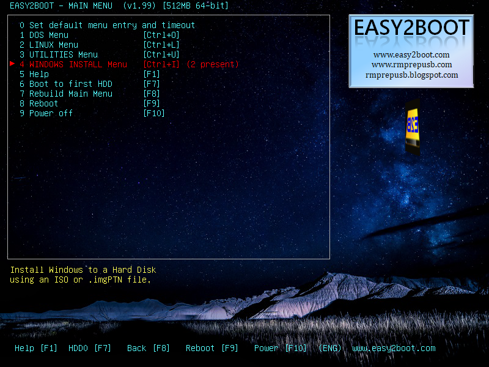
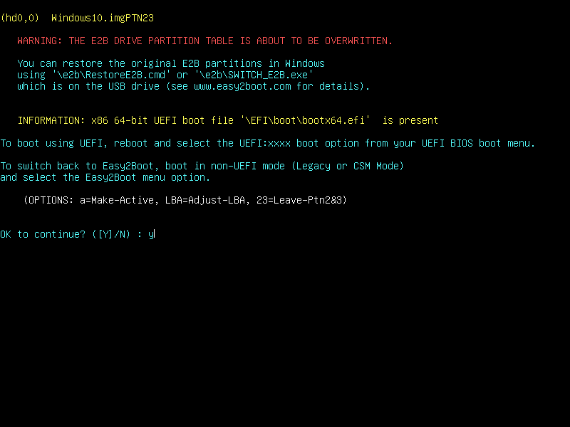
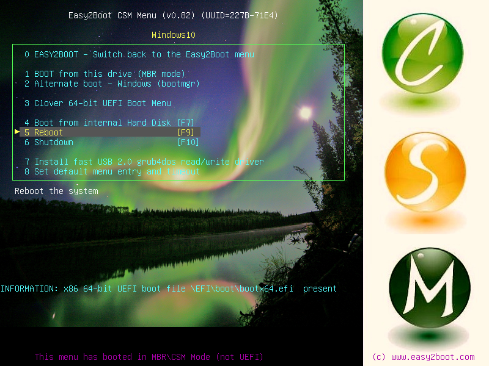
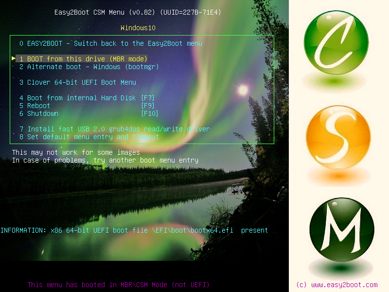

### Table of contents
1. [Introduction](#introduction)
2. [Installation](#installation)
3. [ISO conversion](#iso-conversion)
4. [Adding a ISO to thumbdrive](#adding-a-iso-to-thumbdrive)
5. [UEFI boot](#uefi-boot)

### Introduction
This tutorial is a simplified version (with pictures) of the only functional way that i found to make a multiboot uefi thumdrive.
Is based on [easy2boot](http://www.easy2boot.com/), that is a free multiboot tool, and offers support to multiboot.
This tutorial is based on windows version, because only windows version have graphical interface, and is easy to work.

### Installation
* Download latest version from official [easy2boot website](http://www.easy2boot.com/download) (at time i write this is [v 1.99](http://files.easy2boot.com/200003273-a94b8ab584/Easy2Boot_v1.99.exe)) and install on your computer.
* Connect your thumb driver and certified that is correctly indentified by windows.
* Open easy2boot as administrator (PIC) and secet your thumb drive. Be carefull to not select the wrong drive, and make shure you double checked drive, because **all your data stored on the drive will be erased**
* Click the red button "make E2B drive" and wait. E2B will automatically copy all necessary data to tur your drive in a bootable drive. This step can take a tme, but don't worry, it is running.

### ISO conversion
* In order to use multiboot on UEFI, you need to convert OS images from ISO to a image partition (.imgPTN). for this you will need [mpi pack](http://www.easy2boot.com/download/mpi-pack/).  Download and unzip
* Open unzipped folder and install imDisk (imDisk/imdiskint.exe)
* Double click "CreateDesktopShortcuts.cmd" to create three shortcuts on desktop (MakePartImage, MPI_FAT32 and MPI_NTFS), will be very usefull to convert images.
* Drag an ISO file to MPI_FAT32 and follow on screen instructions to convert to a partition image file (.imgPTN).
If sucess, terminal background will turn green.

**Hint:** The partition image file will be created on same folder that original image (ISO) file.

### Adding a ISO to thumbdrive
* Copy partition image created on previous step to your thumb drive, on correct folder (if is linux, to linux folder, if windows, to windows specific version forder). Its not mandatory, but mantains organization and easy to manage installed images.
You can add many images as you want. The only limitaion is your driver capacity.
* After add a partition image file, run `MAKE_THIS_DRIVE_CONTIGUOUS.cmd` to ensure that all file are contiguous on drive. (If a partition image is not contiguous, will not boot)(And yes, you need to run this each time you add a  partition image).

**Pro tip:** If you want to use a secondary partition (or even a third partition), make it **before** add the first partition image and run `MAKE_THIS_DRIVE_CONTIGUOUS.cmd`. This will ensure that your partition images won't corrupt.
 In order to **no** override partition 2 and 3 (if applicable) when mount a partition image, simple rename partition image from `<OS name>.imgPTN` to `<OS name>.imgPTN23`. I.e. rename from windows10.imgPTN to windows10.imgPTN23. 
**Tip:** Even if you have a second, but not a third partition, you need to rename partition image to `<OS name>.imgPTN23` in order to not overrride then.
 
**OBS:** Due to some limitation on windows driver, only windows 10 (updated to april 2018 or newer) can recognize more tham one partitionon thumbdrive.

### UEFI boot
#### (Explanations and limitations)
You will need a litlle hackish method to multiboot under UEFI.
I don't know why, but seems that UEFI doesn't support multiboot natively (!?). It's nonsesnse, considering that BIOS (legacy) mode can do this like a charm.
On UEFI, you need to switch partitions, to obtain only **one** UEFI bootable partition.
Due to this limitation, you will need a little extra step over a traditional BIOS (legacy) setup.

#### If you have acess to BIOS (legacy) mode
###### Mount UEFI ISO

* Boot your thumbdrive via BIOS (legacy) mode

* Select ISO you want to boot.

* Prompt yes. (This will replace your thumbdrive partition with partition image that you select)

* Press `F9` to reboot machine and boot your thumbdrive on uefi mode

###### Unmount UEFI ISO
* Boot your thumbdrive via BIOS (legacy) mode.

* Press 0 and enter to return to easy2boot menu

#### If you don't have acess to BIOS (legacy) mode
###### Mount UEFI ISO

Windows tutorial... 
TODO

###### Unmount UEFI ISO

Windows tutorial... 
TODO
